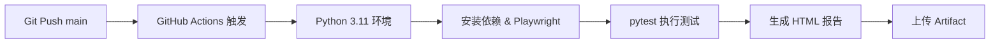

# AI-Powered Web UI 自动化测试框架


> 一个基于 **POM (Page Object Model)** 模式、支持 **数据驱动 (DDT)**，并创新性融合 **LLM 大语言模型** 进行失败自动诊断与优雅降级的企业级端到端 (E2E) 测试框架。覆盖从登录认证到商品搜索、购物车全链路的核心业务场景，配合 CI/CD 流水线实现提交即测、报告自动生成。

---

## 核心亮点

### 🧠 AI 智能自愈诊断

集成大语言模型 (LLM)，当测试用例失败时自动拦截 `Traceback` 错误日志，调用 AI 进行深度根因分析，输出包含**错误定位、原因剖析、修复建议与预防措施**的结构化诊断报告。结合 `tenacity` 实现网络异常自动重试 (最多 3 次，间隔 2 秒)，并在 AI 服务不可用时优雅降级，确保测试流程永不中断。

```bash
# 直接运行 pytest 并由 AI 诊断失败用例
python ai_diagnose.py --pytest

# 对已有日志文件进行诊断
python ai_diagnose.py test_output.log
```

### 🏗️ POM 页面对象模型

严格遵循 **Page Object Model** 设计模式，将页面元素定位、用户操作封装为独立的 Page 类 (`LoginPage` / `ProductsPage` / `CartPage`)，与测试逻辑完全解耦。当 UI 发生变更时，只需修改对应的 Page 文件，测试用例层零改动，维护成本极低。

### 📊 DDT 数据驱动测试

通过 JSON 文件 (`data/test_data.json`) 动态参数化测试用例，利用 `@pytest.mark.parametrize` 实现一份测试代码覆盖多种数据组合。核心购物链路实现 **无代码化回归** —— 新增测试场景只需在 JSON 中追加一条数据记录。

```json
{
  "case_name": "搜索背包并加入购物车",
  "username": "standard_user",
  "password": "secret_sauce",
  "expected_product_name": "Sauce Labs Backpack",
  "unit_price": 29.99,
  "quantity": 1,
  "expected_total_price": 29.99
}
```

### ☁️ CI/CD 自动化流水线

深度集成 **GitHub Actions**，每次代码提交至 `main` 分支即自动触发云端测试执行：环境搭建 → 依赖安装 → 浏览器部署 → 用例运行 → HTML 报告生成与归档，全程无需人工干预。

---

## 项目结构

```
student/
├── .github/
│   └── workflows/
│       └── ui-tests.yml          # GitHub Actions CI/CD 流水线配置
├── data/
│   └── test_data.json            # 数据驱动：登录 & 购物全链路测试数据
├── ai_diagnose.py                # AI 智能错误诊断模块 (LLM + tenacity 重试)
├── login_page.py                 # Page Object: 登录页面
├── products_page.py              # Page Object: 商品列表 & 搜索页面
├── cart_page.py                  # Page Object: 购物车页面
├── test_login.py                 # 测试用例: 登录成功 & 失败场景
├── test_shopping.py              # 测试用例: E2E 购物全链路 (登录→搜索→加购→断言)
├── first_test.py                 # 入门示例脚本 (Playwright 快速上手)
├── requirements.txt              # Python 依赖清单
├── .gitignore                    # Git 忽略规则
└── README.md                     # 项目说明文档
```

**核心模块说明：**

| 文件 | 职责 |
|------|------|
| `ai_diagnose.py` | 捕获 Pytest 错误日志，调用 LLM API 生成诊断报告；内置 tenacity 重试与优雅降级策略 |
| `login_page.py` | 封装登录页元素定位与操作 (navigate / login)，使用显式等待保证稳定性 |
| `products_page.py` | 封装商品搜索、详情浏览、加入购物车、跳转购物车等操作 |
| `cart_page.py` | 封装购物车页面的断言辅助方法 (商品名、单价、数量、总价) |
| `test_data.json` | 集中管理所有测试数据，支持正向 / 异常用例的参数化驱动 |

---

## 技术栈

| 类别 | 技术选型 |
|------|---------|
| 语言 | Python 3.11 |
| 浏览器自动化 | Playwright (同步 API) |
| 测试框架 | Pytest + pytest-playwright |
| 设计模式 | Page Object Model (POM) |
| 数据驱动 | JSON + @pytest.mark.parametrize |
| AI 诊断 | Anthropic Claude API / 兼容 OpenAI 接口的 LLM |
| 重试机制 | tenacity (固定间隔重试 + 连接/超时异常捕获) |
| 报告生成 | pytest-html (自包含 HTML 报告) |
| CI/CD | GitHub Actions |
| 环境管理 | python-dotenv (.env) |

---

## 快速开始

### 1. 克隆仓库

```bash
git clone https://github.com/your-username/student.git
cd student
```

### 2. 创建虚拟环境 & 安装依赖

```bash
python -m venv .venv
# Windows
.venv\Scripts\activate
# macOS / Linux
source .venv/bin/activate

pip install -r requirements.txt
```

### 3. 安装 Playwright 浏览器

```bash
playwright install
```

### 4. 配置环境变量 (AI 诊断功能)

在项目根目录创建 `.env` 文件，填入你的 API 凭据：

```env
ANTHROPIC_BASE_URL=https://api.anthropic.com
ANTHROPIC_API_KEY=sk-ant-xxxxxxxxxxxxxxxx
ANTHROPIC_MODEL=claude-sonnet-4-20250514
```

> **注意：** `.env` 文件已加入 `.gitignore`，不会被提交到版本控制。AI 诊断为可选功能，未配置时测试仍可正常运行。

### 5. 运行测试

```bash
# 运行全部测试用例
pytest -v

# 运行并生成 HTML 报告
pytest --html=report.html --self-contained-html

# 仅运行登录测试
pytest test_login.py -v

# 仅运行购物链路测试
pytest test_shopping.py -v

# 测试失败后，调用 AI 诊断
python ai_diagnose.py --pytest
```

---

## 测试覆盖场景

| 场景 | 用例 | 数据来源 |
|------|------|---------|
| 登录成功 | 标准用户、视觉测试用户 | `test_data.json` → `login_success` |
| 登录失败 | 错误密码、空用户名、空密码 | `test_data.json` → `login_failure` |
| E2E 购物全链路 | 登录 → 搜索 → 详情 → 加购 → 购物车断言 (名称/单价/数量/总价) | `test_data.json` → `shopping_flow` |

---

## CI/CD 流水线



每次提交自动运行，测试报告作为 Artifact 归档，可在 Actions 页面随时下载。

---

## License

MIT License - 自由使用、修改与分发。
